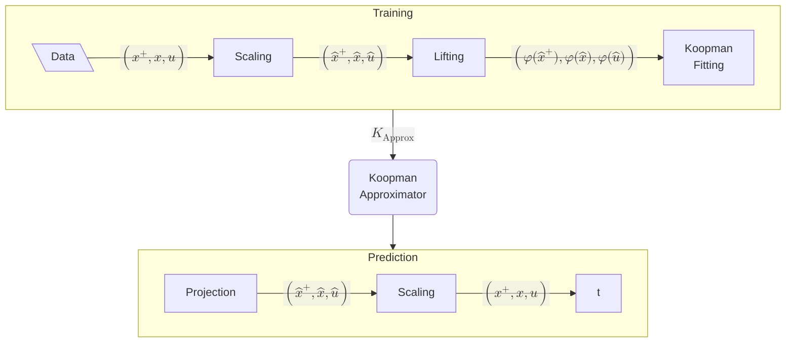

# Matlab Code

```mermaid
flowchart TB
    subgraph Training
        direction LR
        Data@{shape: lean-l} -->|"$$\Bigl(x^+,x,u\Bigr)$$"| Scaling
        Scaling -->|"$$\Bigl(\hat{x}^+,\hat{x},\hat{u}\Bigr)$$"| Lifting 
        Lifting -->|"$$\Bigl(\varphi(\hat{x}^+),\varphi(\hat{x}),\varphi(\hat{u})\Bigr)$$"| Koopman[Koopman\n Fitting]
    end
    Training -->|"$$K_{\mathrm{Approx}}$$"| KR(Koopman\n Approximator) --> Prediction
    subgraph Prediction
        direction LR
        Projection -->|"$$\Bigl(\hat{x}^+,\hat{x},\hat{u}\Bigr)$$"| Scaling2[Scaling]
        Scaling2 -->|"$$\Bigl(x^+,x,u\Bigr)$$"| t
    end
```
